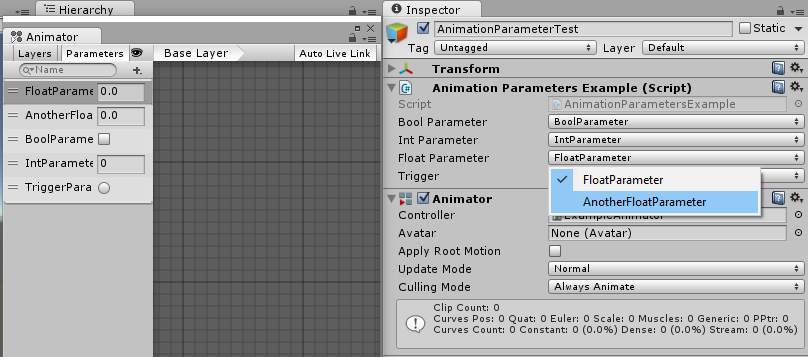
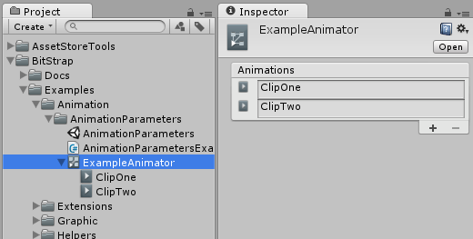
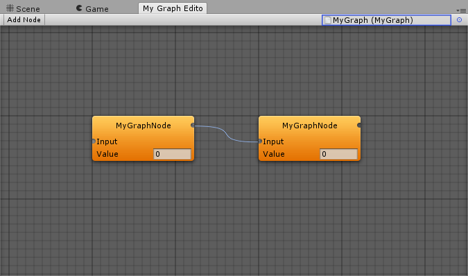
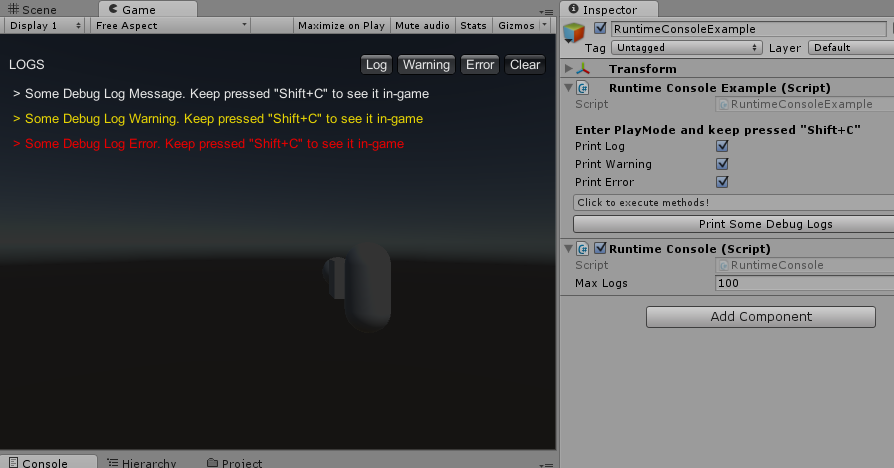
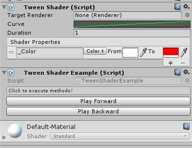

# BitStrap

This is BitCake's set of useful tools that will let you quickly bootstrap a new Unity project.
We use it in our projects and hope it will be of help for yours! :)

## What is this project for?

This is our humble way to give back to the gamedev community.
We hope this will ease other people lives when working with Unity.

You are free to use these tools in whatever project you're doing. Make us proud! :D

## Getting started

Easy! Since this is a Unity project, just download it and then continue from there.
Alternatively, you can add all assets inside `Assets/BitStrap` to an already existing Unity project.

It is also possible to import it directly from the [AssetStore](https://www.assetstore.unity3d.com/en/#!/content/51416).

### Common Use Cases

If you're unsure of how can BitStrap help you, here's a list of common use cases where BitStrap shines!

[[List of common use cases](wiki/Common-Use-Cases)]

## Documentation

NOTE: Right now we're moving all the documentation to this repository [Wiki](https://github.com/bitcake/bitstrap/wiki)!

Although the classes are already documented, we also have a simple web page
containing a feature list followed by a quick explanation of each. You can think
of it as a "table of contents".

[Legacy documentation Link](https://docs.google.com/document/d/1LzsjBetzXnpR-nto8zqYLRxRvjW_DcPP_zOH-stSWVA/pub)

## I need ~healing~ help

* Jefferson Bandeira
    * Twitter : [@thevallcrist](https://twitter.com/thevallcrist)
    * Email   : jefferson@bitcakestudio.com
* Matheus Lessa Rodrigues
    * Twitter : [@matheuslrod](https://twitter.com/matheuslrod)
    * Email   : matheus@bitcakestudio.com
* Vinicius Pacha
    * Twitter : [@vini_pacha](https://twitter.com/vini_pacha)
    * Email   : vini@bitcakestudio.com
* Anyone from BitCake team
    * Twitter : [@bitcakestudio](https://twitter.com/bitcakestudio)
    * Email   : company@bitcakestudio.com

## Awesome contributors

* Timothy McGill ([DragonSmack.com](http://dragonsmack.com) | dragonsmackgames@gmail.com)
* Maso Inar ([bitbucket.org/masoinar](https://bitbucket.org/masoinar/))
* Johannes Deml ([johannesdeml.com](http://johannesdeml.com) | [@DemlJohannes](https://twitter.com/DemlJohannes))

### [Licensed under _MIT License_](LICENSE)

### [How to contribute](CONTRIBUTING.md)

### [Changelog](Assets/BitStrap/Documentation/Changelog.txt)

## Screenshots

###### Access Animation parameters without hardcoded strings.

###### Organize your AnimatorControllers with nested AnimationClips.

###### Make use of these helpful attributes to spice your inspectors up without ever writing a custom editor.

###### Gorgeous and UI ready blur.

###### Extendable graph editor. Make your own nodes!

###### Read those pesky debug logs in runtime even after the build.

###### Animate your shader params without allocating a new Material.

###### Some Vector utilities with an eye candy editor.

